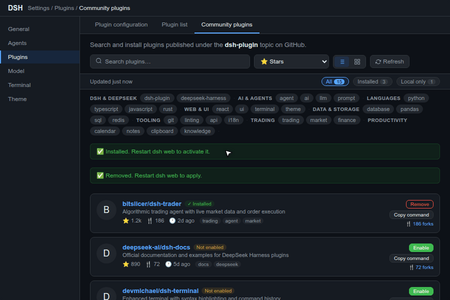

# dsh-community-plugins

[English](README.md) | 简体中文

[DeepSeek Harness](https://github.com/deepseek-ai/deepseek-harness)（DSH）web-GUI 插件：在 **设置 → 插件** 中新增一个「社区插件」标签页。它发现发布在 GitHub [dsh-plugin 主题](https://github.com/topics/dsh-plugin)下的插件，把元数据缓存为**本地 SQLite 目录**，后台持续刷新，让你一键**搜索、浏览、按标签聚合、安装/卸载**。

该标签页与内置的 *插件配置*、*插件列表* 并列。内置的 *插件列表* 只展示已安装内容；这个标签页让社区里的其余插件变得可发现。



## 功能

- **两种视图** — **列表**（丰富卡片）与**网格**（紧凑卡片），工具栏内切换；选择按浏览器记住。
- **分类标签** — topic 标签被归入有名称的类别（DSH 与 DeepSeek、AI 与智能体、编程语言、Web 与 UI、数据与存储、工具链、交易、安全、其他），显示在一个紧凑可滚动的区域内，自带**过滤框**；点击标签钻取该类别，点击 *全部*（或当前标签的 ×）清除。伞标签 `dsh-plugin` 与 `deepseek-harness` 不参与聚合。
- **本地 SQLite 目录** — 插件元数据缓存在 `$DSH_HOME/dsh-community-plugins/catalog.db`（`node:sqlite`）。浏览、搜索、排序和标签聚合都读取这个本地文件，因此即时响应且完全离线可用。
- **结果稳定** — 结果列表绝不自行刷新。只有当你修改筛选条件（搜索词、排序、标签、状态筛选）或按下 `Refresh` 时才重新读取；筛选条件与最近一次结果集在切换设置标签页、刷新页面后依然保留。状态行的**清除筛选**一键重置搜索、排序、标签和状态筛选。
- **状态筛选** — **全部 / 已安装 / 仅本地** 三个选项，各带计数。*已安装* 把社区列表收窄到本 profile 中已有的插件（按解析出的 GitHub 仓库或包名匹配）；*仅本地* 列出完全不在社区目录中的已安装插件 —— 私有仓库、本地检出、主题之外的注册表包 —— 每行展示**从已安装包清单读出的描述、版本与作者**（`file:`/`link:` 规格相对 profile 目录解析，其余走 profile 的 `node_modules`）、其安装规格、按包名移除的**卸载**按钮，以及 —— 若包内附带 —— **内联渲染的 README**（安全的最小 markdown 子集：标题、列表、围栏代码块、粗体/斜体、http(s) 链接；其余一律转义，超过 12k 字符截断）。**多个 README 变体**（`README.md`、`README.zh-CN.md` 等）会变成卡片上的语言标签页，读者可选择自己偏好的语言。GitHub 上确实存在同名仓库的本地插件，还会以**与目录行相同的丰富卡片**渲染（头像、star 数、fork 数 + fork 浏览器、topics、移除/打开操作）—— 元数据每个仓库只取一次，缓存在 SQLite 中。
- **后台刷新** — 目录在 `dsh web` 启动时自我播种（按 star 数与最近更新的头部仓库），并在你修改搜索词时于后台再次刷新，缓存随你的关注点增长。`Refresh` 按钮强制立即更新；抓取进行中时状态行显示 *更新中…*，抓取落地后列表即吸收新行。
- **搜索** 支持名称、所有者、描述或 topic，并可**按 star 数 / fork 数 / 最近创建 / 最近更新 / 名称排序**。*最近更新* 使用 GitHub 真实的 `updated_at`（任何仓库变更），而非卡片上展示的 push 时间。
- **Fork 浏览器** — 每张卡片显示仓库的 **fork 数**；点击后在对话框中列出各 fork（star 数、最后 push、描述、归档状态）。每个 fork 都带 **Compare with upstream** 链接（`github.com/<上游>/compare/<分支>...<forkOwner>:<branch>`），方便查看它携带了哪些上游尚未合并的改动，以及 **Install** 按钮，安装*该 fork* 而非原版。当 fork 将顶替同名的已安装插件时，该行会注明 `replaces <owner/name>`。列表按仓库缓存（10 分钟，`DSH_COMMUNITY_FORKS_TTL_MS`）；对话框内的 `Refresh` 强制重新抓取。
- **安装** — 一键在宿主上执行真实的 `dsh plugin --profile <profile> add github:owner/name`（底层是 pnpm）并同步 `dsh.profile.bundles`。预检会抓取仓库的 `package.json`，拒绝未声明 `dsh.bundle` 清单的仓库 —— 仅挂了 `dsh-plugin` 主题的仓库（harness 本体、应用、示例）会带着明确原因快速失败，而不是抛出费解的 pnpm 报错或干脆卡住。
- **添加本地插件** — 标签页顶部是「添加本地插件」面板。点击 **浏览…** 用文件夹选择器遍历文件系统，或直接粘贴路径（如 `/home/user/my-plugin`），然后点击 **校验**。宿主读取该目录的 `package.json` 并检查 `dsh.bundle.patch` 声明 —— 清单缺失、JSON 无效或缺 DSH bundle 键时，界面给出明确错误且安装按钮保持禁用。校验通过后点击 **Dry run** 在真正提交前确认元数据（名称、版本、作者、描述）；dry run 返回同样的信息而不触碰 pnpm。只有 dry run 成功后 **安装本地插件** 才会激活，点击即在宿主上执行真实的 `dsh plugin add <path>`。
- **文件夹选择器** — **浏览…** 打开一个逐级列出单个目录内容的对话框，由宿主经 `/community-plugins/browse` 遍历。浏览器的文件夹选择器无法不经文件上传提示就返回绝对路径 —— 只想要路径时这是错误的形态，所以改为在服务端读取磁盘 —— 不上传任何东西。已含 `dsh.bundle` 清单的文件夹标记 **plugin** 徽章，可不进入直接用 **Select** 选定；**选择此文件夹** 取当前列出的目录。隐藏目录默认关闭，开关在该标签页打开期间保持。
- **已安装的插件会被标记** — 标签页读取当前 profile 的 `package.json`，之前安装过的插件（无论在此处还是用 `dsh plugin add`）显示绿色 **已安装** 徽章和 **Remove** 按钮（替代 *Install*）。已安装但不在 `dsh.profile.bundles` 里 —— 装了但没加载 —— 的插件还额外显示 **未启用** 徽章。匹配按解析后的 GitHub 仓库进行，回退到包名，因此从 npm 注册表安装且包名与仓库名不同的插件不会被识别。
- **启用 / 停用** — 每个已安装插件（社区的、本地的或 fork 浏览器里的）都有 **Enable** 或 **Disable** 按钮，向 profile 清单的 `dsh.profile.bundles` 添加或移除其名称。徽章与按钮立即翻转；harness 本身在你**重启 `dsh web`** 后加载或卸载插件。只有实际已安装的名称可以切换，清单不会混入未知条目。每条需要重启的通知都带 **重启 dsh web** 按钮：它以启动时的原始命令行重新拉起服务器，新实例应答后页面自动重载。
- **卸载** — 一键执行 `dsh plugin --profile <profile> remove <package>`，从 profile 清单解析真实包名。
- **复制安装命令** — 为终端用户准备：每个列表卡片提供一键复制精确命令的按钮。
- **国际化** — 英文与简体中文，跟随 DSH 语言设置，切换即时生效。
- **主题自适应** — 全部样式基于 DSH 设计令牌（`--dsw-alias-*`），自动跟随明暗主题。

## 安装

> 需要 Node.js 22.19+ 与 pnpm（`dsh plugin` 底层通过 pnpm 安装）。

```sh
# 本地开发
dsh plugin --profile web add /path/to/dsh-community-plugins

# 从 GitHub 安装
dsh plugin --profile web add github:dujar/dsh-community-plugins
```

然后**重启 `dsh web`** 并刷新浏览器页面。安装会自动把 `dsh-community-plugins` 加入 profile 的 `dsh.profile.bundles`；若未加入，请手动把 `"dsh-community-plugins"` 追加到 `$DSH_HOME/profiles/web/package.json` 的该数组并重启。

## 使用

1. 打开 **设置 → 插件 → 社区插件**。
2. 浏览热门插件（按 star 数），在 **列表 / 网格** 间切换，用 **分类标签** 钻取某个话题。
3. 输入关键词搜索 —— 结果即刻来自本地缓存，宿主同时在后台向 GitHub 刷新该查询。此后结果保持不动，直到你再次修改筛选；**清除筛选** 一键回到未过滤列表。
4. 点击卡片的 **fork 数** 浏览该仓库的 fork，在 GitHub 上与上游比较，若某个 fork 携带你想要的改动可直接从它安装。
5. 点击插件的 **Install**。完成后**重启 `dsh web`** 并刷新页面（结果下方的提示会说明这一点）。重启后新装的插件出现在内置的 *插件列表* 标签页中。

## 缓存如何工作

- 宿主用 GitHub search API 抓取该主题，并把每个仓库（名称、所有者、描述、star 数、语言、topics、archived/fork 标志、最后 push）upsert 进 SQLite 目录。
- 启动时抓取按 **star 数** 的前 100 和按 **updated** 的前 100；每次搜索抓取该查询的前 50。抓取被合并并限速（默认每 6 秒一次）以保持在 GitHub 匿名搜索限额（10 次/分钟）之内。遇到 403/429 时 worker 会退避到 GitHub 报告的重置时间。
- GitHub search API 对匿名结果的上限是每次查询 1000 条，因此本地缓存是整个主题的一个**精选、累积式子集**（热门 + 最近活跃 + 你搜过的内容），而不是约 5000 个被打标签仓库的完整镜像。搜索就是把更多主题内容拉进缓存的方式。

## 结构

```
dsh-community-plugins/
  package.json         # manifest + dsh.bundle.patch / dsh.client 声明
  cordis.patch.yml     # 宿主半挂载行（由 profile bundle 机制应用）
  lib/
    index.js           # 宿主半：SQLite 目录 + 后台刷新 + 安装/卸载路由
    client.js          # 浏览器半：list/grid/table 视图 + 标签聚合（React，零构建，i18n）
  test/
    helpers.test.mjs   # 仓库/规格解析辅助函数
    catalog.test.mjs   # SQLite upsert / 查询 / 标签聚合
    host-smoke.test.mjs# 路由注册
    client-smoke.test.mjs # slot 接线
    install-route.test.mjs # 安装预检 + 响应
    folder-picker.test.mjs # browse 路由 + 本地校验/安装流程
    forks.test.mjs     # fork 列表缓存、强制重取、限速回退
    installed-state.test.mjs # profile manifest -> 已安装 / 已启用上报
    toggle-route.test.mjs  # enable/disable 编辑 dsh.profile.bundles，受守卫
    restart-route.test.mjs # 重启响应、调度 restarter、退出；不可信请求被拒
    mini-react.mjs     # 客户端测试共享的 React stub + 假时钟
    persistence.test.mjs # 缓存结果 / 筛选驱动重取 / 清除筛选
    forks-ui.test.mjs  # fork 数 -> fork 浏览器 -> 从 fork 安装
  LICENSE
  README.md           # 英文（主文件）
  README.zh-CN.md     # 简体中文（本文件）
```

## 宿主路由

| 路由 | 方法 | 说明 |
| --- | --- | --- |
| `/community-plugins/catalog` | GET | 本地目录查询。参数 `q`、`tag`、`sort`（stars/forks/created/updated/name）、`filter`（`all`/`installed`/`local`）、`limit`、`offset`。`filter=local` 返回无目录行的已安装插件（标记 `local: true`）。返回 `{ items, total, allCount, tags, counts, filter, refreshing, refreshedAt }`。 |
| `/community-plugins/refresh` | POST | 请求体 `{ q }`；调度一次后台 GitHub 抓取。 |
| `/community-plugins/forks` | GET | 参数 `repo`（`owner/name`）、`force`（`1` 绕过缓存）。返回 `{ ok, items, fetchedAt, cached, stale?, rateLimited? }` —— 一页 fork（最多 50 个，按 star 数），缓存在 SQLite。 |
| `/community-plugins/state` | GET | 返回 `{ profile, plugins: [{ name, spec, repo, enabled }] }` —— profile 名称与已安装的树外插件。包名列在 `dsh.profile.bundles`（即真正挂载）中时 `enabled` 为 `true`。 |
| `/community-plugins/install` | POST | GitHub 安装用请求体 `{ repo: "owner/name" }`，本地文件系统安装用 `{ path: "/local/path", dryRun?: bool }`。`dryRun: true` 只返回元数据而不运行 pnpm。在宿主上执行 `dsh plugin --profile <p> add <spec>`。 |
| `/community-plugins/uninstall` | POST | 请求体 `{ repo: "owner/name" }`，或没有 GitHub 仓库的本地插件用 `{ name }`（该名称必须实际已安装）。执行 `dsh plugin --profile <p> remove <name>`。 |
| `/community-plugins/browse` | GET | `?path=`（空表示用户主目录）与 `?hidden=1`；返回 `{ ok, path, parent, entries: [{ name, path, plugin }], self, home, truncated, reason }`。仅子目录，跟踪符号链接目录，上限 400 条。 |
| `/community-plugins/validate` | POST | 请求体 `{ path: "/local/path" }`；读取本地 `package.json`，检查 `dsh.bundle.patch`，返回 `{ ok, installable, name, version, description, author, reason }`。 |
| `/community-plugins/plugin` | POST | 请求体 `{ name, enabled }`；向 profile 清单的 `dsh.profile.bundles` 添加或移除该名称。仅允许实际已安装的插件名。 |
| `/community-plugins/restart` | POST | 重新拉起本 `dsh web` 进程（detached restarter 在等待端口释放 1.5 秒后重新执行原命令行），先响应 `{ ok, restarting }` 再退出。托管场景可用 `DSH_COMMUNITY_RESTART_CMD` 覆盖重新执行的命令。 |

所有路由沿用与 dsh-trader 相同的 fail-closed 同源/localhost 信任校验：跨源或畸形的 `Origin`/`Referer` 一律拒绝，CORS-simple 内容类型拒绝，仅当 Host 为 localhost 时才视为可信。

## 配置

环境变量（均可选）：

| 变量 | 默认值 | 说明 |
| --- | --- | --- |
| `DSH_COMMUNITY_PROFILE` | 自动检测 | 要安装进的目标 profile。回退顺序：`DSH_PROFILE` → 自动检测 → `web`。 |
| `DSH_PROFILE` | — | 未设置 `DSH_COMMUNITY_PROFILE` 时的回退 profile 名。 |
| `DSH_BIN` | PATH 中的 `dsh` | 用于安装/卸载的 `dsh` 可执行文件完整路径。 |
| `DSH_COMMUNITY_INCLUDE_FORKS` | 未设置 | 任意非空值会把 GitHub fork 收入目录（默认排除 fork）。 |
| `DSH_COMMUNITY_MIN_FETCH_INTERVAL_MS` | `6000` | 两次 GitHub 抓取之间的最小间隔，以不超出搜索限速。 |
| `DSH_COMMUNITY_FORKS_TTL_MS` | `600000` | 缓存的 fork 列表与 GitHub 仓库元数据在被再次询问 GitHub 前的有效期。REST 端点使用 GitHub 的核心限额（匿名 60 次/小时），与搜索分开。 |
| `DSH_COMMUNITY_GITHUB_TOKEN` | — | 可选 bearer token（回退 `GITHUB_TOKEN`），随 GitHub API 请求发送 —— 让 fork 浏览器与本地插件元数据能够访问你有权限的**私有仓库**。 |
| `DSH_COMMUNITY_RESTART_CMD` | — | 覆盖重启命令（如 `systemctl restart dsh-web`）。默认：重新执行本进程自身的命令行。 |

profile 自动检测会找到 `dsh.profile.bundles` 包含本插件的那个 profile，因此承载 web GUI 的自定义 profile 无需任何配置即可工作。

## 开发

```sh
node --check lib/index.js
node --check lib/client.js
npm test
npm pack --dry-run   # 发布前的打包校验
```

`docs/record.mjs` 可重新生成本 README 顶部的 `docs/demo.gif`（用 Playwright 驱动运行中的 DSH 页面录制；`playwright` 仅为 devDependency）。

## 许可

[MIT](./LICENSE)
